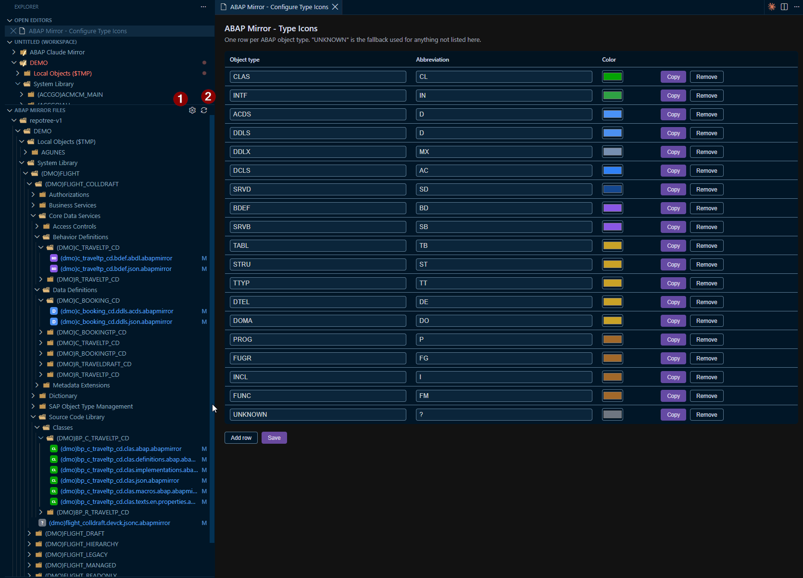

  

<h1 align="center">ABAP Mirror</h1>

  

  Lets <a href="https://claude.com/claude-code">Claude Code</a> read and edit ABAP objects opened through
  SAP's ABAP Development Tools (ADT) for VS Code. Every change stays safely under your review.

  

---

## Why this exists

The [ABAP Development Tools for VS Code extension](https://marketplace.visualstudio.com/items?itemName=SAPSE.adt-vscode)
(`SAPSE.adt-vscode`) opens ABAP repository objects (programs, classes, CDS views, and more) under a virtual `abap://` URI scheme. The
object's source lives entirely in VS Code's in-memory document model, streamed live from the SAP system; it is
**never a real file on disk**.

That's a problem for AI coding assistants like Claude Code, which read and write through the real OS filesystem.
From Claude's point of view, an open `abap://` tab simply doesn't exist: it can't read the code you're looking at,
and it can't propose an edit to it.

**ABAP Mirror** closes that gap. It mirrors whatever ABAP object you have open to a real file on disk, keeps
it in sync in both directions, and gets out of the way otherwise. Claude Code (or any other tool that only
understands real files) can now work with the ABAP code you're actively looking at in ADT.

## Features

- **Automatic mirroring**: open any object in ADT and its source is written to a real file under
  `~/.abap-mirror/`, nested in a folder tree that matches the object's repository path.
- **Two-way live sync**: keep typing in the ADT tab and the mirror updates automatically; edit the mirror file
  (by hand, or by asking Claude Code to change it) and the change flows back into the ADT document buffer.
- **Opens once, then stays out of your way**: the mirror pane reveals itself automatically the first time you
  look at a given object. After that, switching tabs away and back won't keep stealing focus back to it.
- **Open it back up anytime**: right-click any ADT `abap://` document and choose **ABAP Mirror - Open
  Mirror Object**, or run the same command from the Command Palette.
- **ABAP-flavored syntax highlighting** in the mirror view: comments, strings (including `|string templates|`),
  numbers, keywords, operators, and punctuation are colored to match ADT's own conventions.
- **One-flag kill switch**: `abapMirror.enabled` turns the whole thing off instantly, no reload required.
- **Mirror a whole folder at once**: right-click any ABAP package (or other folder) in ADT's Explorer tree and choose **ABAP Mirror - Mirror Folder (with Sub-Objects)** to mirror every object under it, recursively, without opening an editor tab per object. Folders with more than 200 objects ask for confirmation first.
- **ABAP Mirror Files status view**: a new panel in the Explorer sidebar lists every mirrored object in the same hierarchy as ADT's own tree. An object shows red when its ADT document has unsaved changes pending, blue once it's saved. Folders containing an unsaved object expand automatically so you can spot it at a glance.
- **Type icons**: objects in the ABAP Mirror Files panel show a colored icon for their ABAP type (for example green for classes/interfaces, blue for CDS-related objects, purple for behavior definitions/service bindings, yellow for tables and other DDIC objects, brown for programs/function groups). An object with unsaved changes pending in ADT gets a red box around its icon. Fully customizable via **ABAP Mirror - Configure Type Icons**.

## How it works

1. You open (or switch focus to) an ABAP object in ADT.
2. The extension writes its current text to a mirror file under `~/.abap-mirror/`.
3. The mirror opens beside the original the first time, so Claude Code's active-file context picks up a real,
   readable file.
4. From then on, edits on either side are synced to the other automatically, so you don't need to keep both tabs focused.

## Safety model: nothing reaches SAP without your say-so

Syncing an edit back only updates the **in-memory buffer** of the ADT tab. It never calls `document.save()` and
never triggers ADT's activate/transport flow. You'll see the change land in the ADT editor with the normal
unsaved-changes indicator. Nothing reaches the SAP backend until you review it yourself and save/activate through
ADT as usual (`Ctrl+S`, or ADT's own Activate command).

If a mirror file changes while its original ADT document isn't open, the extension reopens that document
automatically (revealed beside your editor, not focused) and applies the change to its buffer, still without
ever calling save. This is how mirrored objects from **Mirror Folder** stay in sync even though most of them are
never opened by hand. If a change can't be synced back at all (the original object can no longer be resolved, for
example it was deleted from the package, or VS Code rejects the edit outright), you get an error notification with
a **Try Again** button instead of the edit silently vanishing. The affected object also shows an orange "!" badge
in the ABAP Mirror Files panel until the retry succeeds.

## Getting started

1. Install [ABAP Mirror](https://marketplace.visualstudio.com/items?itemName=abgunes.abap-mirror)
   from the VS Code Marketplace, alongside `sapse.adt-vscode`.
2. Open any ABAP object through ADT as you normally would.
3. That's it: the mirror file appears automatically, and Claude Code can read/edit it like any other file in your
   workspace.

## Commands & context menu

| Command | What it does |
|---|---|
| **ABAP Mirror - Open Mirror Object** | Opens (or refocuses) the mirror file for the active ABAP document. Available via right-click in the editor, on the editor tab, or the Command Palette. |
| **ABAP Mirror - Mirror Folder (with Sub-Objects)** | Mirrors every object under the right-clicked ABAP package or folder, recursively, without opening editor tabs. Available via right-click on any `abap://` folder in the Explorer tree. |
| **ABAP Mirror - Configure Type Icons** | Opens a settings panel to customize the abbreviation and color shown for each ABAP object type in the ABAP Mirror Files panel. Available from the Command Palette or the panel's title-bar gear icon. |
| **ABAP Mirror - Retry Failed Syncs** | Lists every mirror that failed to sync back to ADT and lets you retry all of them, or a chosen few, in one go. Available from the Command Palette or the panel's title-bar sync icon. |
| **ABAP Mirror - Retry Sync** | Retries syncing a single object back to ADT. Shows up as a hover icon and right-click entry in the ABAP Mirror Files panel, only on an object that isn't fully synced. |
| **ABAP Mirror - Retry Sync for Folder** | Retries syncing every unsynced object under a folder back to ADT. Shows up as a hover icon and right-click entry in the ABAP Mirror Files panel, only on a folder containing something unsynced. |

 

  

 

The ABAP Mirror Files panel's title bar carries two icons, shown above: **1** is the gear, **ABAP Mirror - Configure Type Icons**. **2** is the sync icon, **ABAP Mirror - Retry Failed Syncs**.

## Settings

| Setting | Default | Description |
|---|---|---|
| `abapMirror.enabled` | `true` | Turn mirroring on or off. Takes effect immediately, no reload needed. When off, no mirror files are created/updated and nothing is synced back into `abap://` documents; existing mirror files are left untouched. |
| `abapMirror.icons.enableInMirrorPanel` | `true` | Show a colored icon for each object's ABAP type in the ABAP Mirror Files panel. Turn off to fall back to plain file icons. |

## Where mirror files live

`~/.abap-mirror/`: one file per ABAP object, nested in folders that match its repository path (so paths stay unique), with a short, readable leaf filename, e.g. `zdemo.prog.abap.abapmirror`. Mirror editor tabs carry an M badge (colored by sync state) so they are never confused with the real ADT tab. Safe to delete at any time: it's regenerated the next time you open the corresponding object.

## Data and privacy

Mirror files live under `~/.abap-mirror/`, in your home directory and outside any workspace. That is deliberate, it is what lets filesystem-based assistants read them, but it means your proprietary ABAP source is written to plain files that home-directory backups, cloud sync (OneDrive, iCloud, Dropbox), and desktop search or indexing services can pick up. Treat that directory as you would any local copy of SAP source:

- Keep it inside your normal secured user profile, and exclude it from backup or sync tools if your organization requires it.
- Do not commit or upload mirrored source without review; the `.abapmirror` files are a live copy of what you opened in ADT.
- The whole directory is safe to delete at any time; each object's mirror is regenerated the next time you open it.

## Known limitations

- Only `abap://` documents are mirrored.
- A brand-new object needs to be focused at least once before its mirror file exists.
- No conflict resolution: if you edit both the ADT tab and the mirror file at the exact same moment, whichever
  write lands last wins.
- The bundled grammar is a close approximation of ADT's own ABAP highlighting rather than a byte-for-byte copy, so
  colors can differ slightly depending on your theme.
- Mirroring a folder is a snapshot: objects added to that package afterward won't appear until you run
  **Mirror Folder** again.
- The mirror status view's red/blue coloring is provided through VS Code's file decoration API, which is
  per-file rather than per-view, so the same coloring may also show up on a mirrored file elsewhere in VS Code
  (for example, an open editor tab), not only inside the ABAP Mirror Files panel.
- Type icons are best-effort: the object type is inferred from the dotted suffix on the mirror's own filename (e.g. `.clas.abap`, `.ddls.acds`), which covers the common ADT object types but has not been exhaustively verified against every one that exists. An unrecognized type falls back to a plain gray "?" icon rather than a wrong one.
- If syncing a change back fails, retrying (via the error notification's **Try Again** button) re-sends the mirror's current on-disk content; it does not re-check whether the ADT document itself changed in the meantime.

## Release notes

### 0.1.1

- **Type icons** in the ABAP Mirror Files panel: a colored icon per ABAP object type (class, CDS view, table, program, and more), fully customizable via the new **ABAP Mirror - Configure Type Icons** command. An object with unsaved changes pending in ADT gets a red box around its icon.
- The **Configure Type Icons** settings panel now has a modern, VS Code-themed look, a **Copy** button per row (for quickly cloning a type's color/abbreviation into a new row), and reliably saves your changes (a missing content-security-policy previously made every button in the panel silently do nothing).
- Object type detection is more accurate: it now reads the real ABAP object type suffix embedded in the mirror's own filename, instead of guessing from surrounding folder names. This fixed several object types (CDS views among them) showing the wrong icon or no icon at all.
- Fixed type icons intermittently disappearing after changing a color and scrolling the panel: the tree view now assigns each row a stable identity so VS Code reliably repaints it, and a settings save no longer wipes the entire icon cache (which could delete a still-valid icon file for an unrelated, unchanged object type).
- Sync-back failures (a rejected edit, or an ADT document that can no longer be reopened) now show an error notification with a **Try Again** action and an orange "!" badge in the ABAP Mirror Files panel, instead of failing silently.
- New **ABAP Mirror - Retry Failed Syncs** command: lists every mirror currently failing to sync back to ADT and lets you retry all of them, or a chosen few, at once.
- Unsynced objects and folders in the ABAP Mirror Files panel now show a right-click (and hover-icon) **Retry Sync** action, for retrying just that one object or a whole folder's worth of unsynced objects.

### 0.1.0

First release as **ABAP Mirror**, the successor to
[ABAP Claude Mirror](https://marketplace.visualstudio.com/items?itemName=abgunes.abap-claude-mirror).
Everything from the previous extension plus:

- **Mirror Folder (with Sub-Objects)** command: right-click any ABAP package or folder in ADT's Explorer
  tree to mirror everything under it, recursively, without opening an editor tab per object. Folders with
  more than 200 objects ask for confirmation first, and the run is cancellable.
- **ABAP Mirror Files** panel in the Explorer sidebar: every mirrored object in its original hierarchy,
  red while its ADT document has unsaved changes, blue once saved. Folders holding an unsaved object
  expand automatically.
- Editing a mirror file whose original ADT document is not open now reopens that document automatically
  and applies the change to its buffer. Nothing is ever saved to SAP without you.
- Objects that fail during bulk mirroring are listed in the "ABAP Mirror" output channel instead of
  failing silently.
- Cleaner mirror filenames: no more name prefix. Mirror tabs are marked with an M badge instead.
- Codebase converted to TypeScript.

## Contributing

Issues and pull requests are welcome. See the [project's GitHub page](https://github.com/abgunes/ABAP-Mirror)
for details.

## License

MIT
